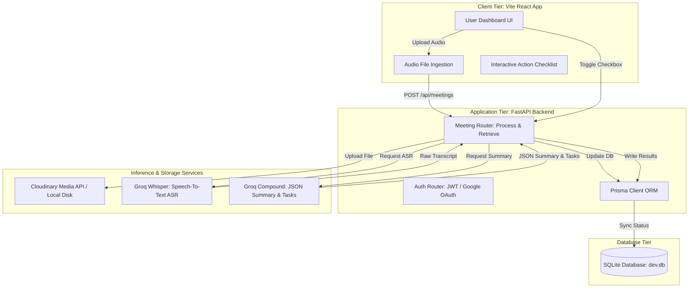

# Minutely: AI Meeting Summarizer

An automated transcription, summarization, and action-item extraction platform. It features a React-based frontend and a backend powered by FastAPI, Prisma ORM (SQLite), Groq (Whisper + LLaMA/Compound), and Cloudinary.

---

## System Architecture



---

## Key Features

- **Multi-Tenant Authentication**: Sign up and login securely. Includes Sign-In with Google (Google Cloud OAuth 2.0) and fallback Email/Password credentials auth.
- **Sub-Second Voice Transcription**: Powered by Groq's whisper-large-v3 running on ultra-fast LPU hardware.
- **Structured Summaries**: Distills raw meeting transcripts into concise highlights, key choices made, and distinct action items using Groq's compound JSON schema generation.
- **Interactive Checklists**: Action items are rendered in a checkable grid showing owners and due dates, updating the database in real-time.
- **Progress Trackers**: Real-time status polling (Uploaded -> Transcribing -> Summarizing -> Done) with responsive status indicators.
- **Cloud Storage & Local Fallback**: Audio files are uploaded to Cloudinary, or stored locally in `backend/uploads/` if credentials are not configured.
- **Export Reports**: Download compiled summary files directly in Markdown or TXT format.
- **Meeting History**: Access, delete, and reopen past meeting logs from a persistent sidebar list.

---

## Directory Structure

```
Minutely/
├── backend/
│   ├── app/
│   │   ├── routes/
│   │   │   ├── auth_routes.py   # Login, signup, Google OAuth endpoints
│   │   │   └── meetings.py      # Uploads, details, action item updates
│   │   ├── services/
│   │   │   ├── auth.py          # Password hashing, JWTs, Google token verification
│   │   │   ├── storage.py       # Cloudinary and local upload handlers
│   │   │   ├── transcription.py # Groq Whisper API pipeline
│   │   │   └── summarizer.py    # Groq Compound JSON mode pipeline
│   │   ├── config.py            # Environment settings loader
│   │   ├── database.py          # Prisma connection controller
│   │   ├── models.py            # Pydantic schema validation
│   │   └── main.py              # FastAPI application entrypoint
│   ├── prisma/
│   │   └── schema.prisma        # Prisma SQLite database models
│   └── requirements.txt         # Backend python packages
├── frontend/
│   ├── public/
│   │   └── favicon.svg          # Minutely custom browser tab icon
│   ├── src/
│   │   ├── components/
│   │   │   ├── AuthPage.jsx     # Credentials Form & Google Sign-In UI
│   │   │   ├── Dashboard.jsx    # Metrics cards, upload form, and meeting viewer
│   │   │   └── LandingPage.jsx  # Landing overview with interactive booking mockup
│   │   ├── App.jsx              # Application router and session controller
│   │   ├── main.jsx             # React entrypoint
│   │   └── index.css            # Responsive styles and theme variables
│   ├── index.html               # Main HTML Document template
│   ├── package.json             # NPM package scripts & dependencies
│   └── vite.config.js           # Vite server settings
├── run.py                       # Root orchestrator script (automatic port freeing)
├── .env                         # Local environment keys configuration
├── .gitignore                   # Exclusions list for node_modules, .env, and local DBs
└── README.md                    # Documentation
```

---

## Technical Stack

- **Frontend Client**: React (Vite, JavaScript, CSS3)
- **Backend API**: FastAPI (Python)
- **Database**: Prisma ORM (SQLite database file `dev.db`)
- **Speech Ingestion**: Groq Cloud API (`whisper-large-v3` ASR)
- **Inference Model**: Groq Cloud API (`groq/compound` LLM)
- **File Storage**: Cloudinary SDK (with local disk fallback)
- **Authentication**: Google Cloud OAuth 2.0 & JWT with bcrypt hashing

---

## Setup & Running Guide

### 1. Configure Credentials

Create a `.env` file at the root of the project. Add your credentials:

1. **Groq API Key (Required)**: Create a free account at the [Groq Console](https://console.groq.com/) and generate a key starting with `gsk_`.
2. **Cloudinary (Optional)**: If you want cloud storage, create a free account at [Cloudinary](https://cloudinary.com/) and copy your Cloud Name, API Key, and API Secret. If left blank, the app will store files locally in `backend/uploads/`.
3. **Google OAuth Client ID (Optional)**: If you want to use Sign-In with Google, create a Google Cloud Project, set up the OAuth Consent Screen (add your origin URL to authorized redirect URIs), and create a Web Client credential.

### 2. Install Dependencies

Open your command line in the project root and install requirements:

* **Backend**:
  ```bash
  pip install -r backend/requirements.txt
  ```
* **Frontend**:
  ```bash
  cd frontend
  npm install
  cd ..
  ```

### 3. Run the Application

Start both the backend and frontend simultaneously with our root orchestrator script:

```bash
python run.py
```

The script will:
1. Automatically run `prisma db push` to initialize the SQLite database file and generate the python prisma client library if not present.
2. Search for and terminate any previous processes holding ports `8000` or `5173`.
3. Start the FastAPI backend server on `http://127.0.0.1:8000`.
4. Start the Vite React development server on `http://localhost:5173`.

Open **[http://localhost:5173](http://localhost:5173)** in your browser to view the application!
